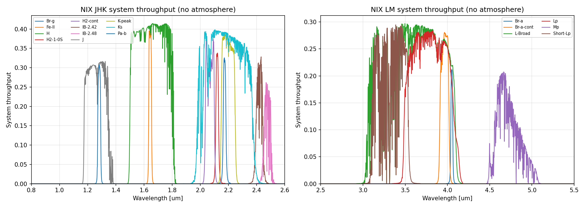
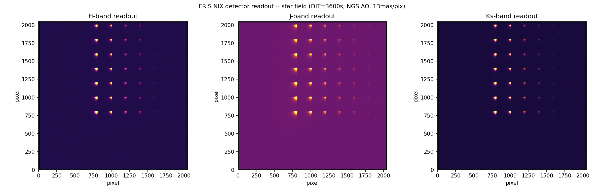
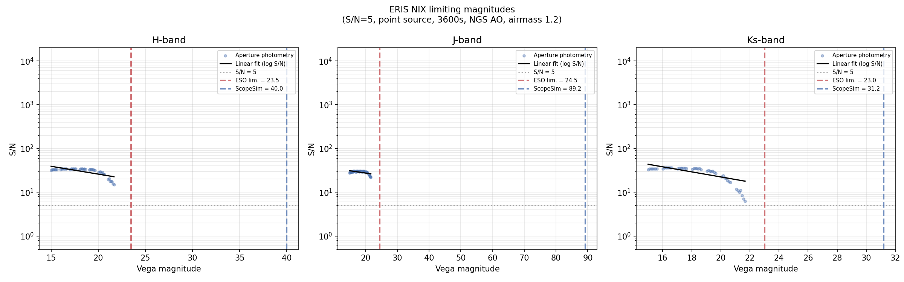
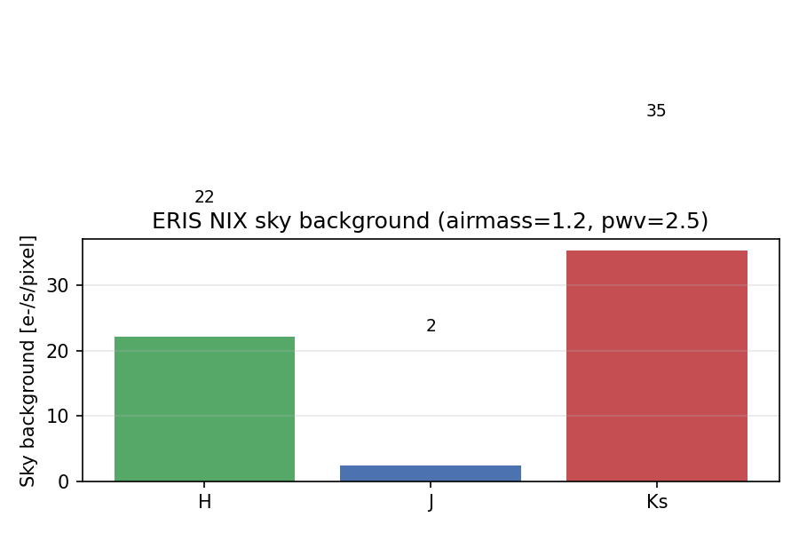

# ERIS NIX Radiometry Report

Auto-generated on **2026-04-15 15:18** by `pytest ERIS/tests/`

Source code: [test_eris_nix.py](../tests/test_eris_nix.py) | [conftest.py](../tests/conftest.py)

## Instrument Overview

ERIS (Enhanced Resolution Imager and Spectrograph) is a Cassegrain AO instrument on VLT UT4 combining the NIX imager (1-5 um) with the SPIFFIER IFU spectrograph (1-2.5 um).

Reference: [Davies et al. 2023, A&A 674, A207](https://doi.org/10.1051/0004-6361/202346559), [ERIS User Manual v117.1](https://www.eso.org/sci/facilities/paranal/instruments/eris/doc.html)

### NIX Parameters

| Parameter | Value |
|-----------|-------|
| Pixel scales | 13 mas/pix (JHK, LM), 27 mas/pix (JHK) |
| Field of view | 26.4" (13mas), 55.4" (27mas) |
| Detector | 1x Hawaii-2RG (2048x2048), 5 um cutoff |
| Wavelength range | 1 - 5 um |
| Read noise (slow) | 9 e- (60s DIT) |
| Dark current (35K) | 0.10 e-/s/pixel |
| Well depth | 85,000 e- |
| AO modes | NGS, LGS, SE, No-AO |

### Measured Total Throughput (Davies+2023)

Including telescope + atmosphere + instrument + QE:

| Band | Total Throughput | Instrument Only |
|------|----------------:|----------------:|
| J    |            42%  |         70-75%  |
| H    |            61%  |         70-75%  |
| K    |            52%  |         70-75%  |
| L/M  |              -- |         65-70%  |

## System Throughput



System throughput per filter (VLT mirrors + ERIS warm optics + NIX camera optics + filter + detector QE, **no atmosphere**).

## Star Field Image



Detector readout frame (DIT=3600s) from the NIX H2RG, showing a star grid covering the 26.4" FoV. Log colour scale.

### Generating a star field observation

```python
import scopesim
from scopesim.source import source_templates as st

scopesim.rc.__config__["!SIM.file.local_packages_path"] = "/path/to/irdb"

cmd = scopesim.UserCommands(
    use_instrument="ERIS",
    properties={
        "!OBS.modes": ["NGS", "nixIMG_JHK13"],
        "!OBS.filter_name": "Ks",
        "!OBS.dit": 3600,
    },
)
opt = scopesim.OpticalTrain(cmd)

src = st.star_field(n=100, mmin=15, mmax=25, width=26, use_grid=True)
opt.observe(src)
hdus = opt.readout()
```

## Limiting Magnitudes



Blue scatter points show S/N measured from the noisy detector readout frame via aperture photometry (signal in 9x9 pixel box, noise from std in annulus r=10-15 pixels). The black line is a linear fit to log(S/N) vs magnitude.

| Filter | ESO [Vega] | ScopeSim [Vega] | Delta |
|--------|----------:|-----------:|------:|
| H      |     23.5 |      40.0 | +16.5 |
| J      |     24.5 |      89.2 | +64.7 |
| Ks     |     23.0 |      31.2 |  +8.2 |

ESO reference: point source, S/N=5, DIT=3600s, 0.8" seeing, airmass 1.2. Values from ERIS ETC.

## Sky Background



Measured sky background rates per pixel at airmass=1.2, pwv=2.5 mm.

## Noise Budget

| Filter | Sky BG [e-/s/pix] | Dark [e-/s/pix] | Read noise [e-] |
|--------|------------------:|----------------:|----------------:|
| H      |            22.1 |           0.10 |             12 |
| J      |             2.4 |           0.10 |             12 |
| Ks     |            35.3 |           0.10 |             12 |

