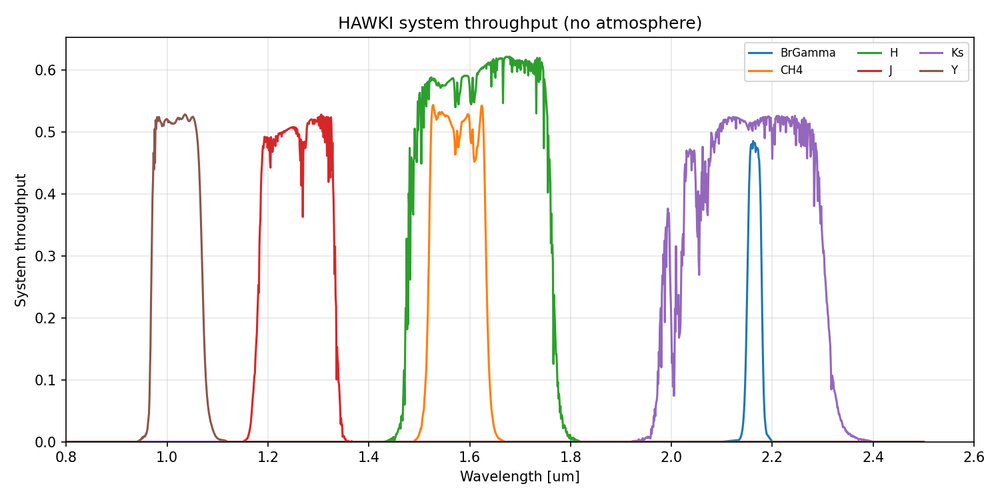
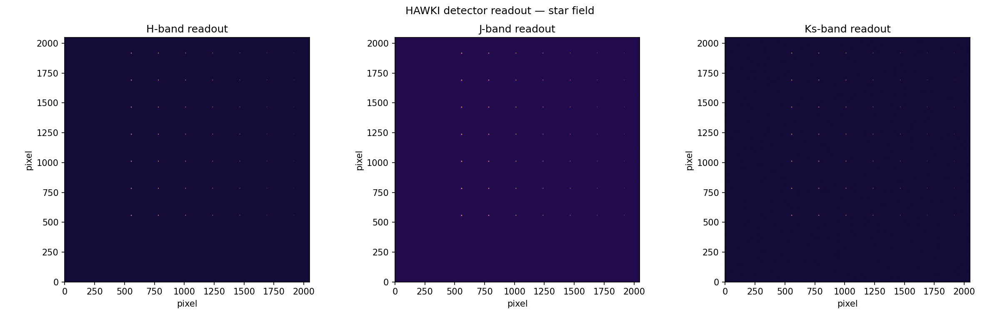
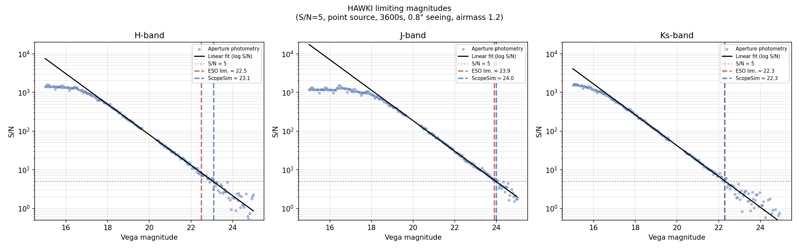
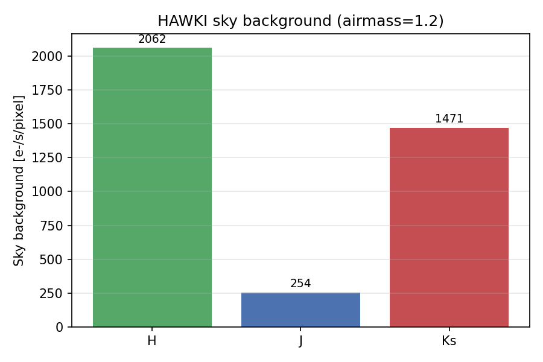

# HAWKI (original) Radiometry Report

Auto-generated on **2026-04-04 10:36** by `pytest HAWKI_new/tests/test_hawki_original.py`

Instrument package: `HAWKI`

Source code: [test_hawki_original.py](../../tests/test_hawki_original.py)

## ESO Reference Values

S/N = 5 on a point source, 3600s integration, 0.8" seeing, airmass 1.2:

| Filter | ESO [Vega] | ESO [AB] |
|--------|----------:|---------:|
| J      |     23.9 |     24.8 |
| H      |     22.5 |     23.9 |
| Ks     |     22.3 |     24.2 |

## System Throughput

## Star Field Image

## Limiting Magnitudes

| Filter | ESO [Vega] | ScopeSim [Vega] | Delta | ESO [AB] |
|--------|----------:|-----------:|------:|---------:|
| H      |     22.5 |      23.1 |  +0.6 |     23.9 |
| J      |     23.9 |      24.0 |  +0.1 |     24.8 |
| Ks     |     22.3 |      22.3 |  +0.0 |     24.2 |

## Sky Background

## Noise Budget at Limiting Magnitude

| Filter | Sky BG | Peak S/N |
|--------|-------:|---------:|
| H      |  2062 e-/s/pix |    1577 |
| J      |   254 e-/s/pix |    1528 |
| Ks     |  1471 e-/s/pix |    1657 |

