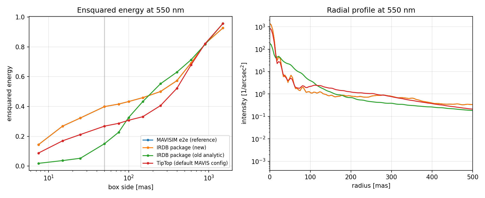
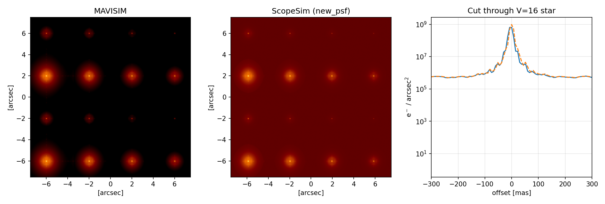
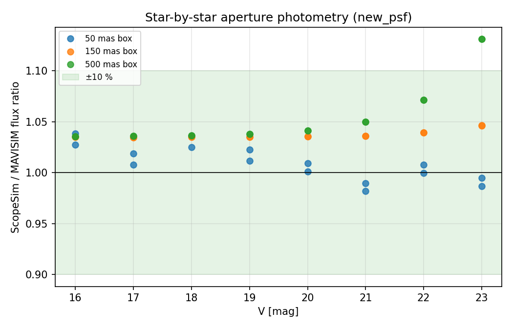

# MAVIS IRDB package vs MAVISIM — imaging cross-validation

Generated by [`../../background_info/compare_mavisim.py`](../../background_info/compare_mavisim.py)
on 2026-08-24. Raw console output: [`comparison_output.txt`](comparison_output.txt).

**Reference simulator:** [MAVISIM](https://github.com/smonty93/mavisim) v1.1
(Monty et al. 2021, MNRAS 507, 2192) — monochromatic V band, end-to-end MCAO
PSFs from the consortium's LQG tomography simulations (J. Cranney, ANU),
flat throughput factors (VLT 0.75 × AOM 0.63 × QE 0.89).

**Comparison protocol:** a 4×4 grid of stars (V = 16–23 Vega, A0V spectra)
is fed to both simulators with *identical photon rates*: the flux handed to
MAVISIM is the integral of each star's spectrum × skycalc atmosphere ×
MAVIS V filter × VLT collecting area — the same spectra, curves, and area
ScopeSim uses internally. Each simulator then applies its own throughput
chain and PSF. Noise effects are disabled on both sides; the skycalc sky in
the ScopeSim frames is subtracted by the aperture photometry.

## 1. PSF at 550 nm

| PSF | Strehl | FWHM [mas] | EE(50 mas) | EE(250 mas) |
|---|---|---|---|---|
| MAVISIM e2e (reference) | 0.348 | 15.0 | 0.399 | 0.500 |
| **IRDB package (new)** | **0.348** | **15.0** | **0.399** | **0.500** |
| IRDB package (old analytic) | 0.045 | 18.4 | 0.150 | 0.552 |
| TipTop (default MAVIS config) | 0.215 | 18.4 | 0.268 | 0.406 |

The new package PSF (`PSF_MAVIS_mcao.fits`) uses the MAVISIM e2e PSF *as*
its 550 nm plane, so the reference and package curves coincide exactly (the
blue reference curve is hidden under the orange one). The old analytic PSF
was calibrated to the published performance *floors* (Strehl > 8 %,
EE(50 mas) > 15 %), which the LQG simulations beat by more than a factor 2 —
hence the factor ~2.7 photometry error it produced in a 50 mas aperture.

Strehl ratios are measured against an FFT diffraction reference for the
8.2 m/1.0 m VLT pupil at each PSF's own sampling and window, which is why
the old analytic PSF (0.92″ window) reads 0.045 here rather than its
nominal 0.10.

## 2. V-band imaging comparison

Star-by-star aperture photometry, ScopeSim/MAVISIM flux ratio
(mean ± std over the 16 stars):

| box | new PSF | old analytic PSF |
|---|---|---|
| 50 mas | **1.010 ± 0.017** | 0.352 ± 0.007 |
| 150 mas | **1.037 ± 0.004** | 0.983 ± 0.003 |
| 500 mas | **1.055 ± 0.031** | 1.131 ± 0.033 |

All apertures agree well within the ±10 % target. The remaining +3–5 %
offset is the throughput-chain difference: ScopeSim's three aluminium VLT
mirrors give ≈0.77 vs MAVISIM's flat 0.75 (+2 %), plus small differences
from integrating wavelength-dependent QE/AOM/filter curves against
MAVISIM's monochromatic 550 nm factors. The single point outside the band
(V = 23, 500 mas box, +13 %) is sky-subtraction residual on the faintest
star: its 500 mas box holds only ~600 e⁻ against ~4700 e⁻ of subtracted
skycalc sky.

Before/after with the old analytic PSF: [`images_old_psf.png`](images_old_psf.png),
[`photometry_old_psf.png`](photometry_old_psf.png).

## 3. Sky background

| sky model | e⁻/s/arcsec² | V mag/arcsec² |
|---|---|---|
| ScopeSim, skycalc default (V equivalent) | 1317 | 20.41 |
| MAVISIM, dark-sky default 21.61 mag/arcsec² | 436 | 21.61 |
| MAVISIM, surf_bright matched to skycalc | 1317 | 20.41 |

The two packages assume different *skies* (skycalc's default moon/airglow
vs MAVISIM's canonical dark-sky value) — a factor 3 in surface brightness.
With the same assumed surface brightness, MAVISIM's crude monochromatic
sky bookkeeping and ScopeSim's spectral integration agree to <0.1 %
(matched by construction of the V-magnitude equivalence; the point is that
neither chain loses photons).

## 4. TipTop

The `TipTopPSF` ScopeSim effect (branch `kl/tiptop-psf`) generates MAVIS
PSFs on demand from the TipTop server and caches them (one call per filter
band, ≤1024² pixels). With the stock tiptop_ipy MAVIS template
(0.8″ seeing, 30° zenith angle, classical reconstructor) it lands between
the old analytic floor and the LQG e2e PSF: Strehl 0.215, EE(50 mas) 0.27.
Photometry in small apertures with the TipTop PSF would sit ~33 % below
MAVISIM — use it as a conservative performance scenario, not as a MAVISIM
substitute.

## Caveats

- MAVISIM v1.1 is monochromatic V; nothing constrains the package off
  V band. The other PSF planes are analytic estimates calibrated to the
  550 nm Strehl via Maréchal scaling.
- Both simulators used the *on-axis* PSF; field variation (the 11×11
  MAVISIM PSF grid, 1.7 GB) was not compared.
- MAVISIM positions stars on 7.5 mas pixels, the package on 7.36 mas; box
  apertures therefore differ by ≤1 fine pixel in size, a ≲0.5 % effect.
