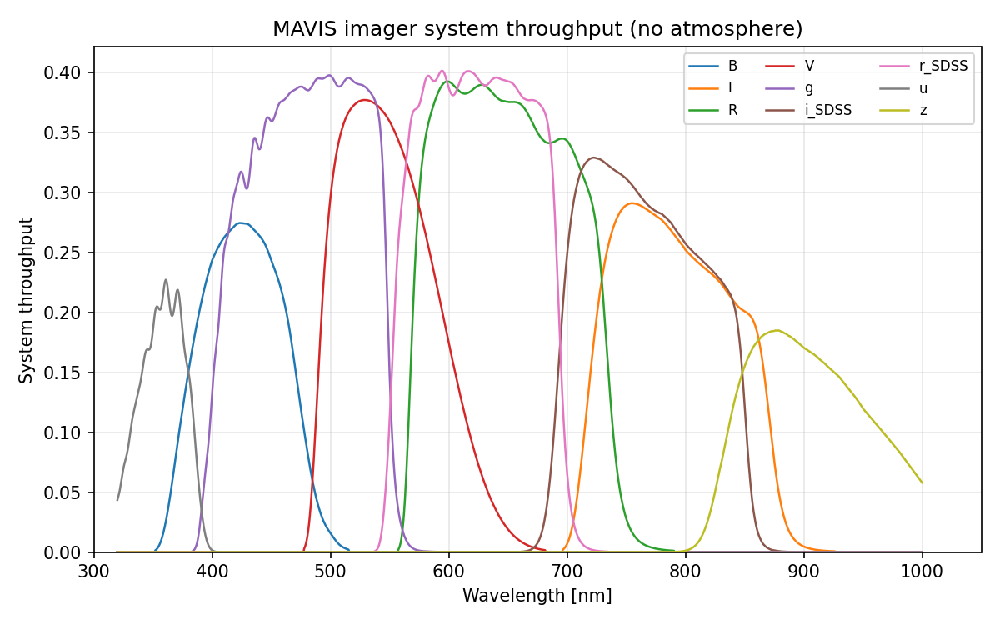

# MAVIS Radiometry Report

Auto-generated on **2026-08-24 18:20** by `pytest MAVIS/tests/`

MAVIS (MCAO Assisted Visible Imager and Spectrograph) is a next-generation ESO VLT instrument at the Nasmyth A focus of UT4 (Yepun). It uses an MCAO system to deliver near-diffraction-limited images in the visible over a 30x30 arcsec field of view.

Instrument parameters, the filter list and known limitations are documented in [README.md](README.md); the underlying specifications and their sources are in [../background_info/mavis_baseline_specification.md](../background_info/mavis_baseline_specification.md). This file holds only the numbers measured by the test suite.

**Note:** the PSF is an analytic MCAO model rather than an end-to-end simulation, and the filter curves are the standard passbands MAVIS is expected to carry rather than measured MAVIS hardware. This report is a consistency check, not a science-grade performance prediction.

*Radiometry validation not run. Use `pytest MAVIS/tests/ -m slow` to include it.*

## System Throughput

System throughput per filter (VLT mirrors + AO module + filter + detector QE, **no atmosphere**).

