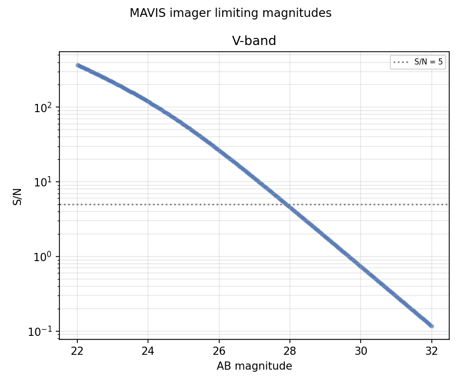

# MAVIS Radiometry Report

Auto-generated on **2026-09-01 13:32** by `pytest MAVIS/tests/`

MAVIS (MCAO Assisted Visible Imager and Spectrograph) is a next-generation ESO VLT instrument at the Nasmyth A focus of UT4 (Yepun). It uses an MCAO system to deliver near-diffraction-limited images in the visible over a 30x30 arcsec field of view.

Instrument parameters, the filter list and known limitations are documented in [README.md](README.md); the underlying specifications and their sources are in [../background_info/mavis_baseline_specification.md](../background_info/mavis_baseline_specification.md). This file holds only the numbers measured by the test suite.

**Note:** the PSF is an analytic MCAO model rather than an end-to-end simulation, and the filter curves are the standard passbands MAVIS is expected to carry rather than measured MAVIS hardware. This report is a consistency check, not a science-grade performance prediction.

## Validation against published numbers

| Quantity | Measured | Reference |
|---|---|---|
| Sky background, V band | 1314 e-/s/arcsec2 | 1316 e-/s/arcsec2, from integrating the skycalc emission spectrum through the system throughput by hand |
| Limiting magnitude, V band | 28.96 mag | > 29 mag published, at 5 sigma in 1 hr; measured in a 50 mas aperture |

The sky comparison is an end-to-end check of the photon bookkeeping: emission, collecting area, throughput, QE, integration time and gain, against the same quantities integrated directly.

## IFU cube modes

| Configuration | Cube (z, y, x) | Window [um] | Measured R | Published R | Deviation |
|---|---|---|---|---|---|
| IFU_HR_BLUE | 2048 x 144 x 100 | 0.5060-0.5299 | 15177 | 14700 | +3.2 % |
| IFU_HR_RED | 2048 x 144 x 100 | 0.6793-0.7206 | 11476 | 11500 | -0.2 % |
| IFU_LR_BLUE | 2048 x 144 x 100 | 0.5184-0.5816 | 5887 | 5900 | -0.2 % |
| IFU_LR_RED | 2048 x 144 x 100 | 0.6598-0.7402 | 5940 | 5900 | +0.7 % |

Measured from an unresolved emission line, at the fine 25 mas spaxel scale. The window is a fraction of each arm, centred on `!OBS.wavelen`; the spectrograph's optical layout is unpublished, so these are cube-output modes rather than dispersed frames. See [../background_info/planning/step1_ifu_cube_mode.md](../background_info/planning/step1_ifu_cube_mode.md).

IFU sky level in IFU_LR_BLUE over 0.5184-0.5816 um: **836.1 e-/s/arcsec2** measured against **836.0** from integrating the skycalc emission spectrum through the system throughput by hand (ratio 1.0000), with detector noise switched off.

Note that dark current in a cube is applied per voxel, which is right for a dispersed spectrograph -- one voxel is one detector pixel -- but means the dark term is multiplied by the number of spectral bins and dominates the sky in these windows. The dark current value is an estimate inherited from the imager CCD, so IFU sensitivity estimates are only as good as that guess.

The limiting magnitude is measured in a fixed 50 mas aperture, the box the ensquared-energy specification refers to. The published figure assumes optimal PSF-weighted extraction and dark time, whereas skycalc is queried with its default (not dark) moon and airglow settings, so the number here is expected to come out a magnitude or so brighter.

## System Throughput

System throughput per filter (VLT mirrors + AO module + filter + detector QE, **no atmosphere**).

## Limiting Magnitudes

