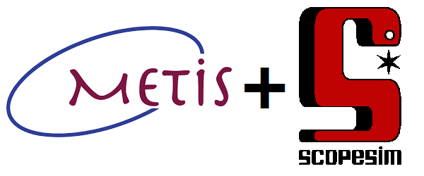

|pic1|
======

Introduction
------------
The METIS data simulator is based on the generic simulator software Scopesim, a descendant of the older SimCado/SimMETIS interface. METIS itself is handled as an instrument package that contains configuration files for the various instrument modes as well as data files describing the components of the instruments.
The new METIS data simulator currently supports the imaging and long-slit modes. The LM-band high-resolution IFU (LMS) mode will be offered soon.

Prerequisites
-------------

- A working installation of a recent Python version
- A working installation of Jupyter if you want to run the simulator from notebooks. This is necessary to run the example notebooks contained in the instrument package.
- A working installation of the Python package installer pip

.. note::

   If you come across a bug or get stuck with a certain aspect of ScopeSim or
   the METIS package, please get in touch with us (email addresses below).

   **Your feedback is the only way we know** what needs to be changed/improved
   with the package and the simulator.

   Please always provide the output of the command ``scopesim.bug_report()`` run on your installation.

Installation & setup
--------------------

This is a short overview of the installation and setup procedure; for a more detailed presentation see `Introduction_to_Scopesim_for_METIS <example_notebooks/Introduction_to_Scopesim_for_METIS.ipynb>`_.

1. Install ``scopesim`` in your python environment::

    $ pip install scopesim

   To upgrade an existing installation do::

    $ pip install -U scopesim

2. Create a working directory where you want to run simulations, e.g.::

    $ mkdir ~/path/to/playing_with_scopesim/
    $ cd ~/path/to/playing_with_scopesim

3. Install relevant irdb packages into this directory::

    $ python
    >> import scopesim
    >> scopesim.download_packages(["METIS", "ELT", "Armazones"])

   This will install the packages in the subdirectory ``./inst_pkgs``.

4. The METIS package includes a number of tutorial notebooks in the directory ``./inst_pkgs/METIS/docs/example_notebooks/`` (see `Python notebooks`_).

   Copy notebooks to the working directory (i.e. ``./``) to run them.::

    $ cp ./inst_pkgs/METIS/docs/example_notebooks/<Notebook-Name.ipynb> .

5. In a terminal, execute the notebook by calling::

    $ jupyter notebook <filename.ipynb>

6. Follow instructions and explanations in the notebook. Some notebooks use example data; the commands to download these data from the scopesim server are included in the notebooks.

You can then edit the notebooks and use them as a starting point for your own simulations.

Python notebooks
----------------

These notebooks can be found either:

- [locally] in the METIS instrument package in ``docs/example_notebooks``, or
- [download] in the `METIS/docs section of the IRDB Github repository <https://github.com/AstarVienna/irdb/tree/master/METIS/docs/example_notebooks>`_

.. warning::
   Notebooks should be run in your working directory, **NOT** directly in the
   ``docs/example_notebooks`` folder. Please copy the desired notebook out of
   this folder.

Ideally your folder structure should look like this::

    working-dir
    |- <desired notebook>.iypnb
    |
    |- inst_pkgs
      |- METIS
      |  |- docs
      |     |- example_notebooks
      |        |- <desired notebook>.iypnb      # copy out to working-dir
      |- ELT
      |- Armazones

Introductory notebooks
++++++++++++++++++++++

.. list-table::
   :widths: 25 75
   :width: 900px
   :header-rows: 1

   * - Name
     - Description
   * - | `Introduction_to_Scopesim_for_METIS.ipynb <example_notebooks/Introduction_to_Scopesim_for_METIS.ipynb>`_
       | `Introduction_to_Scopesim_for_METIS.pdf <example_notebooks/Introduction_to_Scopesim_for_METIS.pdf>`_
     - Introductory overview of how to run simulations in Scopesim

Scientific use-case notebooks
+++++++++++++++++++++++++++++

.. list-table::
   :widths: 25 75
   :width: 900px
   :header-rows: 1

   * - Name
     - Description
   * - `IMG_L_N-examples.ipynb <example_notebooks/IMG_L_N-examples.ipynb>`_
     - Imaging observations of HL Tau and an AGN model in the L and N band
   * - `LSS-YSO_model_simulation.ipynb <example_notebooks/LSS-YSO_model_simulation.ipynb>`_
     - Long-slit spectroscopy in the L-band of three models of a young stellar object
   * - | `LSS_AGN-01_preparation.ipynb <example_notebooks/LSS_AGN-01_preparation.ipynb>`_
       | `LSS_AGN-02_simulation.ipynb <example_notebooks/LSS_AGN-02_simulation.ipynb>`_
     - | Long-slit spectroscopy in the N-band of an AGN model. The first notebook describes
       | how the input data are prepared for Scopesim, the second runs the simulation.

Notebooks on individual effects
+++++++++++++++++++++++++++++++

These notebooks can be found in ``docs/example_notebooks/demos``.

.. list-table::
   :widths: 25 75
   :width: 900px
   :header-rows: 1

   * - Name
     - Description
   * - `demo_adc_wheel.ipynb <example_notebooks/demos/demo_adc_wheel.ipynb>`_
     - How to use the atmospheric dispersion correctors.
   * - `demo_auto_exposure.ipynb <example_notebooks/demos/demo_auto_exposure.ipynb>`_
     - How to select `dit`/`ndit` automatically.
   * - `demo_chopping_and_nodding.ipynb <example_notebooks/demos/demo_chopping_and_nodding.ipynb>`_
     - How to produce chop-nod difference images in the N band.
   * - `demo_detector_modes.ipynb <example_notebooks/demos/demo_detector_modes.ipynb>`_
     - How to set detector readout modes.
   * - `demo_filter_wheel.ipynb <example_notebooks/demos/demo_filter_wheel.ipynb>`_
     - How to use the filter wheel(s).
   * - `demo_lss_simple.ipynb <example_notebooks/demos/demo_lss_simple.ipynb>`_
     - Basic procedure for long-slit spectroscopy.
   * - `demo_grating_efficiency.ipynb <example_notebooks/demos/demo_grating_efficiency.ipynb>`_
     - Demonstration of spectral (grating) efficiency.
   * - `demo_slit_wheel.ipynb <example_notebooks/demos/demo_slit_wheel.ipynb>`_
     - How to use the slit wheel for spectroscopy (and imaging)
   * - `demo_rectify_traces.ipynb <example_notebooks/demos/demo_rectify_traces.ipynb>`_
     - How to obtain wavelength-calibrated and rectified 2D spectra.

Documentation and useful references
-----------------------------------

- `ScopeSim documentation <https://scopesim.readthedocs.io/en/latest/>`_
- `Sky Object Templates documentation <https://scopesim-templates.readthedocs.io/en/latest/>`_
- `METIS homepage <https://metis.strw.leidenuniv.nl/>`_
- For experts: GitHub repositories:

  + `simulator package ScopeSim <https://github.com/AstarVienna/scopesim>`_
  + `instrument-specific packages irdb <https://github.com/AstarVienna/irdb>`_.

Contact points
--------------
`ScopeSim Slack <https://join.slack.com/t/scopesim/shared_invite/zt-143s42izo-LnyqoG7gH5j~aGn51Z~4IA>`_

Email:

- scopesim@univie.ac.at
- kieran.leschinski@univie.ac.at
