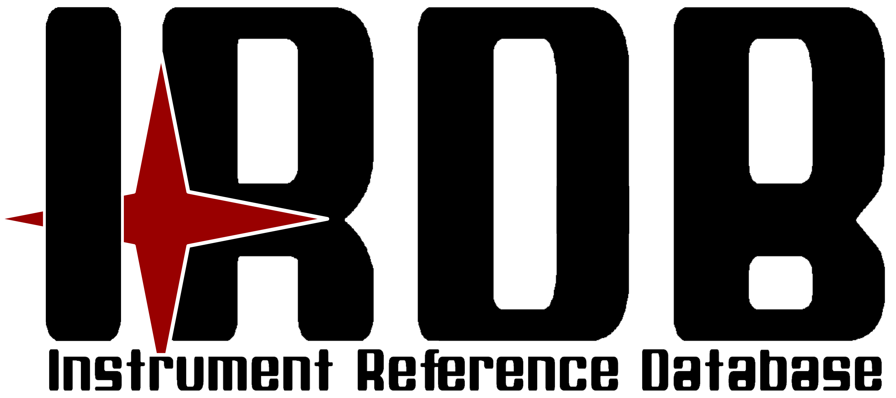

.. ReadTheDocs index file. Originally from docs/source/index.rst
   Moved here so that all package docs are accessible to Sphinx and RTD

The Instrument Reference Database (IRDB) contains the instrument specific
information used by the ScopeSim astronomical instrument data simulator.

Instrument-Specific "Getting Started" Guides
--------------------------------------------

.. toctree::
   :maxdepth: 2
   :caption: Contents:

   METIS/docs/readme
   METIS/docs/misc
   MICADO/docs/readme.rst

Instrument Packages in the IRDB
-------------------------------

+-----------+------------+------------+
| Locations | Telescopes |Instruments |
+===========+============+============+
| Armazones | ELT        | MICADO     |
|           |            +------------+
|           |            | METIS      |
+-----------+------------+------------+
| Paranal   | VLT        | HAWKI      |
+-----------+------------+------------+
|           |            | LFOA       |
+-----------+------------+------------+
